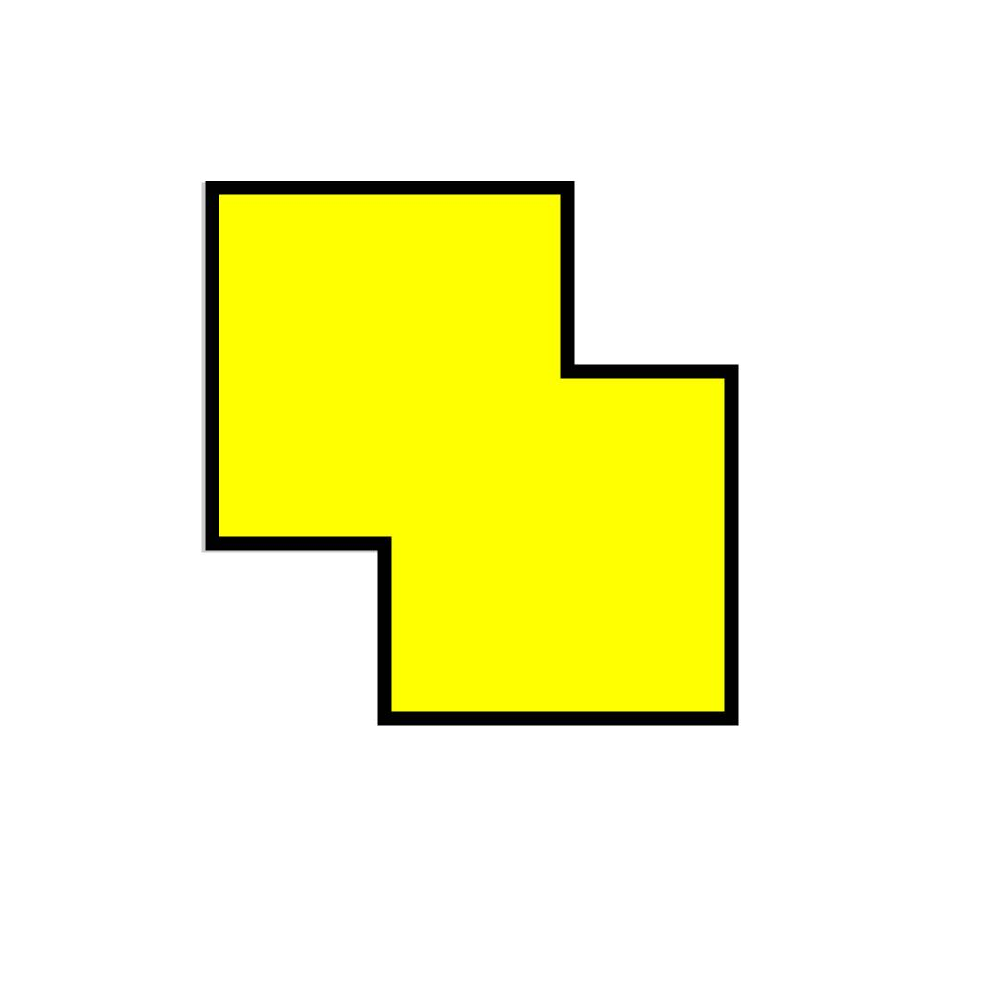

# キーホルダー作りの手順

## 目次

0. [はじめに](#anchor0)
1. [画像を準備](#anchor1)
1. [Vectorizeでの作業](#anchor2)
1. [Illustratorでの作業とレーザーカッターでの印刷](#anchor3)
1. [組み立て](#anchor4)
1. [参考資料リンク](#anchor5)

### 0.はじめに

講習会に参加していない方は、SAの補助なしにレーザーカッターを利用することはできません。  
また、この手順書で使用されている単語の意味を予め説明しておきます。  
- SVG形式 : JPEG、PNG形式のように画像を点の集合で表現するのではなく、複雑な計算式によって色や曲線を表現したベクタ形式の画像の１つです。計算式で描画しているため、拡大縮小しても劣化することが無く、Illustratorのようなソフトでも編集しやすいのが特徴です。
- パス : ベクタ形式画像の計算式で描画された線のこと。
- レイヤー : Illustratorなどのソフトでは、透明なフィルムのようなものを沢山重ね、それぞれのフィルムに描画を行う機能があります。このフィルムをレイヤーといいます。例えば、空を書くレイヤー、人物を書くレイヤー、雪を書くレイヤーなど、役割を分けてそれぞれに描画ができるということです。この手順書では、パスの集まりという認識で十分です。

### 1.画像を準備

この時点で画像の形式は問いませんが、色が少なく、構造が単純な画像が望ましいです。ここまでが、事前に参加者の方に行ってもらう準備です。もちろん画像制作からGeek DojoのIllustratorで行いうことも可能です。  
例）[背景なしサルのPNG画像](https://www.nicepng.com/ourpic/u2w7q8r5y3u2y3t4_monkey-emoji-android/)  

### 2.Vectorizerでの作業

Online Image Vectorizerというサービスを利用し、画像をSVG形式に変換します。[Vectorizerへのリンク](https://www.vectorizer.io/)

- 無料版では、利用回数制限が課されます。Vectorizerを多数回利用する場合は、Geek Dojoのアカウントでログインすることで、回数制限を解除できます。
- SVG画像を持ち込んだ場合も、色ごとにパスを再構築してくれるのでVectorizerに通すことを推奨します。  
  例）複雑なパス（パスを黒で表現） > Vectorizerで単純化  
  
  

1.  画像をUpload  
      
    Uploadが完了すると以下のような画面が表示されます。  
    

2.  Input Optionsの設定

    - Colorsの項目で、画像を何色とみなしベクタ化するのかを決められます。可能な限り少ない数にします。
      
    - PNG形式などの画像で、背景が透過されている場合には、下のFiltersからRemove Alpha Channelを選択し、Addすることで背景を生成できます。背景は、キーホルダーの土台設計に利用するので、透過されている場合には作成しておきましょう。  
        
        
      例）背景透過 > Remove Alpha Channelで白背景作成  
      

3.  Output Optionsの設定

- Indivisual layerを選択し、色ごとにレイヤー分けしてダウンロードできるようにします。  
   

- Colorsでは最終的にダウンロードする色を表示しています。同じ色で認識させたいのに、別の色として認識されている場合には、色のアイコンをドラッグ＆ドロップで、同じ円の中に入れます。そうすることで複数の色を、１つの平均化された色として認識させることができます。この操作は右のパラメーターの％を上げることで、自動で行う事もできます。  
  例）２色の黄色 > 同じ円に入れて、１色の黄色とみなす

    
    

4.  画像をダウンロード  
    上記の設定が完了したら、vectorizeボタンを押します。その後、Downloadボタンを押して、画像をダウンロードします。
    

### 3.Illustratorでの作業とレーザーカッターでの印刷

キーホルダーは２段構造になっています。

- １段目の土台：上のパーツを貼り付けるために使用
- ２段目のパーツ：画像と同じ色を表現するために土台の上に接着

これらのパーツをカットするためのデータを、Illustratorで作成します。  
もし、パーツのパスが見つからない場合は以下を参考にしてみてください。
- 最前面のレイヤーのパスしか見えないことがありますが、最前面のレイヤーを移動することで下のレイヤーを表示できます。

- 土台のパスは背景のパスをそのまま利用できます。  
  例）背景パス > 周りの四角のパスを削除後、塗りなし（パスを赤で表現）  
   
  

Vectorizerは異なる色を区切る線を１本作成するだけなので、内側のレイヤーを移動させることで、外側のパーツの形が崩れることがあります。  
例）元画像が青と緑のSVG画像の場合。緑色のパーツの中に青色のパーツをはめる形を作るならば、レイヤーは右下のように分けるべきですが、単純に青いレイヤーを移動しただけでは、左下のようになってしまいます。  
  
これを防ぐために、レイヤーを動かすのではなく、レイヤー全体を複製後、それぞれ不要な部分を削除する方法をオススメします。特に、穴の位置などを一致させるには、この方法が効果的です。  

1. 直径2mmの穴を描画します。（パスを赤で表現）  
  

2. 色別に複製します。（パスを赤で表現）  
  

3. 余分なパスを削除します。紐を通すための穴は土台と、上のパーツ両方に残すようにしてください。（パスを赤で表現）  
    

1. 上記の画像のようにパーツごとの枠を描画したら、利用するアクリル板ごとに別ファイルに移し、レーザーカッターでカットします。  
例）カット後のパーツ  

### 4.組み立て

1. 使用するボンド、キーホルダー用の紐は、Geek Dojo入ってすぐ左の白いトレーの中にあります。  
 

1. ボンドを使って、土台と上に置くパーツを接着します。  

1. 紐を付けて完成です。  
   例）紐をつけたキーホルダー（完成品）  
   

1. [Geek Dojoアクリル板枚数](https://docs.google.com/spreadsheets/d/1uDBB9SodrVZSNPJrtWRJF4fX7Tl_8-21VgOjDVtsEaQ/edit?usp=sharing)を更新して終了

### 5.参考資料リンク

- [Geek Dojoアクリル板枚数](https://docs.google.com/spreadsheets/d/1uDBB9SodrVZSNPJrtWRJF4fX7Tl_8-21VgOjDVtsEaQ/edit?usp=sharing) : シート２に色の説明画像もあります。
- [あるあるトラブル](https://docs.google.com/spreadsheets/d/1OapK_HnBMLim75Laok5cMkfY5h4Lu2_lsoPCFTRIJG8/edit?usp=sharing) : キーホルダーで頻繁に起こるトラブルとその解決策をまとめました。
- [レーザーカッターの利用方法](https://github.com/AizuGeekDojo/LaserCutterInstruction/tree/master/doc_pdf) : 講習会資料としても利用されます。
- [オリジナルキーホルダー作りウェブサイト](https://aizugeekdojo.github.io/KeyHolder/WebSite/) : 予約の仕方、レーザーカッター以外の設備もまとめてあります。
